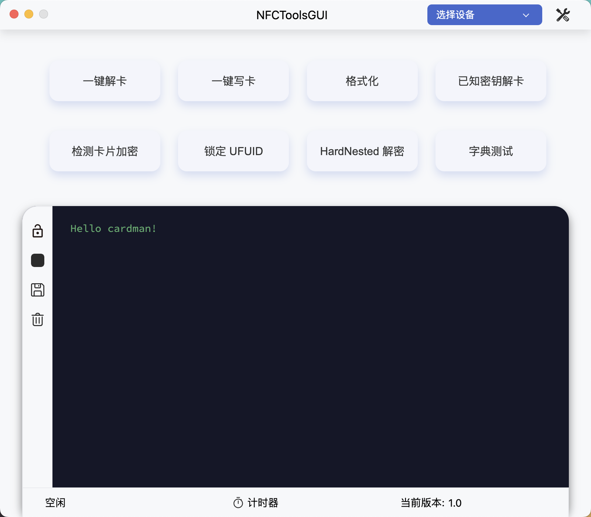

# NFCToolsGUI


一个与 <b>PN532</b> 进行交互的跨平台程序, 支持 Windows、Linux 和 macOS。

[English](https://github.com/GSWXXN/NFCToolsGUI/blob/main/README.md) | 简体中文


## 支持的功能
* MFOC 解卡
* 写卡
* 格式化卡片
* 锁定 UFUID
* HardNested 破解
* 字典测试
* 转储编辑
* 转储比较

## 界面预览


## 驱动安装
根据实际情况选择驱动, 以 CH341 为例
### Windows
下载安装 [CH341SER](http://www.wch-ic.com/downloads/CH341SER_ZIP.html)

### macOS
下载安装 [CH341SER_MAC](http://www.wch-ic.com/downloads/CH341SER_MAC_ZIP.html)

### Linux
通常来说，Linux 内核已经包含了 CH341 的驱动，因此不需要额外安装驱动。如果你的 Linux 内核不包含 CH341 的驱动，那么可以下载安装 [CH341SER_LINUX](http://www.wch-ic.com/downloads/CH341SER_LINUX_ZIP.html)

## 如何编译
### 编译核心组件
#### Windows
1. 安装 [MSYS2](https://www.msys2.org/)
2. 进入此项目目录并在 `CMD` 中执行如下命令
    ```bash
     C:\msys64\msys2_shell.cmd -mingw64 -defterm -here -no-start -c ./compile.sh
    ```
    > 将 `C:\msys64\` 替换为 MSYS2 的安装路径

#### Linux
1. 安装依赖 (以 Ubuntu 为例)
    ```bash
    sudo apt-get install curl autoconf libtool pkg-config patchelf liblzma-dev libreadline-dev
    ```
    > 不同发行版的依赖名称可能不同
2. 进入此项目目录并执行如下命令
    ```bash
    sh ./compile.sh
    ```
#### macOS
1. 安装依赖
    ```bash
    brew install autoconf automake libtool pkg-config
    ```
2. 进入此项目目录并执行如下命令
    ```bash
    sh ./compile.sh
    ```
### 编译 GUI
1. 安装 [Node.js](https://nodejs.org/)
2. 进入此项目目录并执行如下命令
    ```bash
    npm install
    npm run make
    ```
3. 编译完成后，可在 `out` 目录下找到编译好的文件 
   > 你也可以使用 `npm run start` 来调试运行此项目

## 目录使用
除了安装目录, 程序还使用以下目录来存放用户文件:
* Windows: `%APPDATA%\NFCToolsGUI`
* Linux: `$XDG_CONFIG_HOME/NFCToolsGUI` 或者 `~/.config/NFCToolsGUI`
* macOS: `~/Library/Application Support/NFCToolsGUI`

## Linux 中的注意事项
### 找不到类似 `ttyUSB0` 的串口
首先执行
```bash
sudo dmesg | grep brltty
```
如果输出类似如下内容，那么说明你的串口已经被 brltty 占用了：
```
interface 0 claimed by ch341 while 'brltty' sets config #1
```
执行
```bash
sudo apt remove brltty
```
卸载 brltty，然后重新插拔设备即可


### 确认已找到串口, 但是无法打开
在 Linux 中，要访问串口需要有足够的权限。一种解决办法是将当前用户添加到 dialout 用户组中，这个用户组具有访问串口的权限。这样，程序就可以在不使用 sudo 的情况下访问串口。

可以使用以下命令将当前用户添加到 dialout 用户组中：
```bash
sudo usermod -a -G dialout <username>
```
添加完成后，你需要注销并重新登录才能使更改生效。

如果你不想将用户添加到 dialout 组中，那么可以通过修改串口文件的权限来让程序能够访问串口。例如，可以使用以下命令将 /dev/ttyUSB0 文件的权限修改为 666：
```bash
sudo chmod 666 /dev/ttyUSB0
```
> 请注意，这种方法会使其他用户也能访问串口，因此不推荐使用。

## 许可证
* [AGPL-3.0](https://www.gnu.org/licenses/agpl-3.0.html)
```
Copyright (C) 2022-2023 GSWXXN

This program is free software: you can redistribute it and/or modify
it under the terms of the GNU Affero General Public License as
published by the Free Software Foundation, either version 3 of the
License, or (at your option) any later version.

This program is distributed in the hope that it will be useful,
but WITHOUT ANY WARRANTY; without even the implied warranty of
MERCHANTABILITY or FITNESS FOR A PARTICULAR PURPOSE.  See the
GNU Affero General Public License for more details.

You should have received a copy of the GNU Affero General Public License
along with this program.  If not, see <http://www.gnu.org/licenses/>.
```

<details>
   <summary>AGPL-3.0 许可证允许您</summary>
   <ul>
      <li>自由使用、修改和分发受 AGPL-3.0 许可证保护的软件。</li>
      <li>将受 AGPL-3.0 许可证保护的软件用于商业目的。</li>
      <li>以源代码或者可执行文件的形式重新分发软件。</li>
      <li>将受 AGPL-3.0 许可证保护的软件与其他软件或代码结合使用，形成衍生作品，只要这些衍生作品同样受 AGPL-3.0 许可证保护并遵守 AGPL-3.0 许可证的条款和条件。</li>
      <li>在网络上提供使用 AGPL-3.0 许可证保护的软件，只要您提供完整的源代码和修改的内容，并允许用户以相同的 AGPL-3.0 许可证继续分发您的修改和衍生作品。</li>
   </ul>
</details>

<details>
   <summary>AGPL-3.0 许可证禁止您</summary>
   <ul>
      <li>修改 AGPL-3.0 许可证保护的软件并以闭源的方式分发。</li>
      <li>在您提供的网络服务中使用 AGPL-3.0 许可证保护的软件，而不向用户提供完整的源代码和修改的内容。</li>
   </ul>
</details>

## 致谢
- [MifareOneTool](https://github.com/xcicode/MifareOneTool/): 一个运行在 Windows 平台上的 Mifare Classic GUI 工具 
- [Electron](https://github.com/electron/electron): 建立跨平台桌面应用程序的框架
- [mfoc](https://github.com/nfc-tools/mfoc): Mifare Classic 离线破解工具
- [crypto1_bs](https://github.com/aczid/crypto1_bs): Bitsliced Crypto-1 暴力破解器, 在本项目中仅用于收集 nonces
- [cropto1_bs](https://github.com/vk496/cropto1_bs): HardNested 暴力破解器
- [libnfc](https://github.com/nfc-tools/libnfc): 不依赖平台的 NFC 库
- [nfc-mflock](https://github.com/duament/nfc-mflock): Mifare Classic 锁定工具
