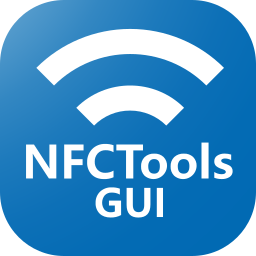
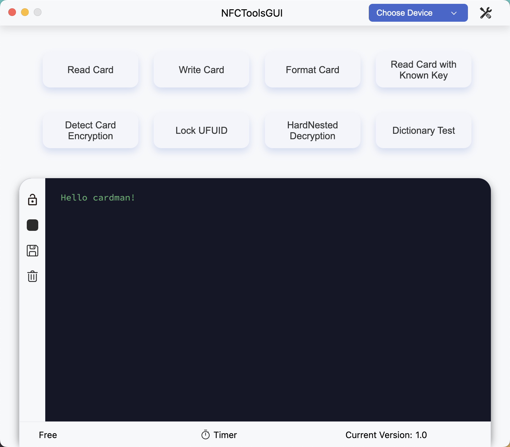

# NFCToolsGUI


A cross-platform program that interacts with <b>PN532</b>, supports Windows, Linux, and macOS.

English | [简体中文](https://github.com/GSWXXN/NFCToolsGUI/blob/main/README-zh_CN.md)


## Supported functions
* Crack card using MFOC
* Write card
* Format card
* Lock UFUID
* HardNested crack
* Dictionary testing
* Dump editing
* Dump comparison

## Interface preview


## Driver installation
Choose the appropriate driver according to your actual situation, taking CH341 as an example.
### Windows
Download and install [CH341SER](http://www.wch-ic.com/downloads/CH341SER_ZIP.html)

### macOS
Download and install [CH341SER_MAC](http://www.wch-ic.com/downloads/CH341SER_MAC_ZIP.html)

### Linux
Usually, the Linux kernel already includes the driver for CH341, so there is no need to install the driver separately. If your Linux kernel does not include the CH341 driver, you can try to download and install [CH341SER_LINUX](http://www.wch-ic.com/downloads/CH341SER_LINUX_ZIP.html)

## How to compile
### Compile the core component
#### Windows
1. Install [MSYS2](https://www.msys2.org/)
2. Enter the project directory and execute the following command in `CMD`
    ```bash
     C:\msys64\msys2_shell.cmd -mingw64 -defterm -here -no-start -c ./compile.sh
    ```
   > Replace `C:\msys64\` with the installation path of MSYS2.

#### Linux
1. Install dependencies (using Ubuntu as an example)
    ```bash
    sudo apt-get install curl autoconf libtool pkg-config patchelf liblzma-dev libreadline-dev
    ```
   > The dependency names may vary on different distributions.
2. Enter the project directory and execute the following command:
    ```bash
    sh ./compile.sh
    ```
#### macOS
1. Install dependencies:
    ```bash
    brew install autoconf automake libtool pkg-config
    ```
2. Enter the project directory and execute the following command:
    ```bash
    sh ./compile.sh
    ```
### Compile GUI
1. Install [Node.js](https://nodejs.org/)
2. Enter the project directory and execute the following command:
    ```bash
    npm install
    npm run make
    ```
3. After compilation, the compiled files can be found in the `out` directory
   > You can also use `npm run start` to debug this project.

## Directory usage
In addition to the installation directory, the program also uses the following directories to store user files:
* Windows: `%APPDATA%\NFCToolsGUI`
* Linux: `$XDG_CONFIG_HOME/NFCToolsGUI` or `~/.config/NFCToolsGUI`
* macOS: `~/Library/Application Support/NFCToolsGUI`

## Notes on Linux
### Cannot find a serial port like `ttyUSB0`
First, run the following command:
```bash
sudo dmesg | grep brltty
```
If the output is similar to the following content, it means that your serial port has been occupied by brltty:
```
interface 0 claimed by ch341 while 'brltty' sets config #1
```
Execute:
```bash
sudo apt remove brltty
```
to uninstall brltty, and then plug in the device again.


### Find the Serial Port But Can't Open It
In Linux, accessing a serial port requires sufficient permissions. One solution is to add the current user to the dialout group, which has permissions to access the serial port. This way, the program can access the serial port without using sudo.

You can use the following command to add the current user to the dialout group
```bash
sudo usermod -a -G dialout <username>
```
After adding, you need to log out and log in again to make the changes take effect.

If you don't want to add the user to the dialout group, you can modify the permissions of the serial port file to allow the program to access it. For example, you can use the following command to modify the permission of the `/dev/ttyUSB0` file to 666:
```bash
sudo chmod 666 /dev/ttyUSB0
```


## License
* [AGPL-3.0](https://www.gnu.org/licenses/agpl-3.0.html)
```
Copyright (C) 2022-2023 GSWXXN

This program is free software: you can redistribute it and/or modify
it under the terms of the GNU Affero General Public License as
published by the Free Software Foundation, either version 3 of the
License, or (at your option) any later version.

This program is distributed in the hope that it will be useful,
but WITHOUT ANY WARRANTY; without even the implied warranty of
MERCHANTABILITY or FITNESS FOR A PARTICULAR PURPOSE.  See the
GNU Affero General Public License for more details.

You should have received a copy of the GNU Affero General Public License
along with this program.  If not, see <http://www.gnu.org/licenses/>.
```

<details>
   <summary>AGPL-3.0 license allows you to:</summary>
   <ul>
      <li>use, modify, and distribute software protected by the AGPL-3.0 license for free.</li>
      <li>use software protected by the AGPL-3.0 license for commercial purposes.</li>
      <li>redistribute software in source code or executable form.</li>
      <li>combine software protected by the AGPL-3.0 license with other software or code to create derivative works, as long as these derivative works are also protected by the AGPL-3.0 license and comply with the terms and conditions of the AGPL-3.0 license.</li>
      <li>provide software protected by the AGPL-3.0 license on a network, as long as you provide the complete source code and modified content, and allow users to distribute your modifications and derivative works under the same AGPL-3.0 license.</li>
   </ul>
</details>

<details>
   <summary>AGPL-3.0 license prohibits you from:</summary>
   <ul>
      <li>modifying software protected by the AGPL-3.0 license and distributing it in a proprietary manner.</li>
      <li>using software protected by the AGPL-3.0 license in your network service without providing users with the complete source code and modified content.</li>
   </ul>
</details>

## Credits
- [MifareOneTool](https://github.com/xcicode/MifareOneTool/): A GUI Mifare Classic tool on Windows
- [Electron](https://github.com/electron/electron): A framework for building cross-platform desktop applications.
- [mfoc](https://github.com/nfc-tools/mfoc): Mifare Classic Offline Cracker
- [crypto1_bs](https://github.com/aczid/crypto1_bs): Bitsliced Crypto-1 brute-forcer, used only for nonce collection in this project.
- [cropto1_bs](https://github.com/vk496/cropto1_bs): HardNested brute-forcer.
- [libnfc](https://github.com/nfc-tools/libnfc): Platform-independent NFC library.
- [nfc-mflock](https://github.com/duament/nfc-mflock): A simple utility to lock block0 of UFUID cards.
